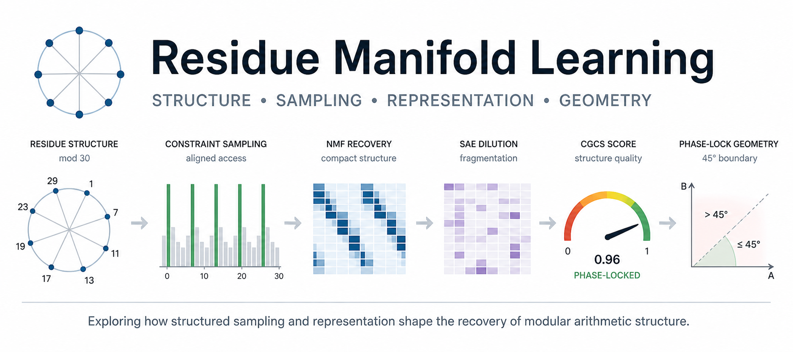

# Residue Manifold Learning

  <a href="paper/paper.md"><strong>📄 Read the paper (draft)</strong></a>

**Residue Manifold Learning (RML)** studies structure, sampling, representation, and **distributed consistency** in modular arithmetic using a mod30 residue manifold as a controlled experimental setting.

The project develops a reproducible pipeline showing how structured sampling, representation, and **constraint consistency across noisy links** determine whether underlying modular structure is preserved, degraded, or recoverable.

---

## Core idea

Prime-support residues modulo 30 form an eight-lane discrete manifold embedded in ℤ/30ℤ.

RML investigates:

- how structure exists independently of representation,
- how sampling determines access to that structure,
- how representation preserves or fragments structure,
- how **distributed systems degrade under noisy links**,  
- how **projection restores constraint consistency**,  
- how **stability becomes cost-dependent at scale**.

A central result is:

> reconstruction quality alone does not imply structural fidelity.

---

## What this repo demonstrates

The notebooks now build a full systems chain:

1. **Structure** — mod30 residue lanes form a discrete manifold  
2. **Sampling** — constraint-aligned sampling concentrates signal  
3. **Recovery** — NMF recovers compact structure  
4. **Failure modes** — sparse representations fragment structure  
5. **Metric** — CGCS quantifies structural fidelity  
6. **Geometry** — structure corresponds to a cosine phase-lock (~45°)  
7. **Distributed systems** — noisy links degrade global consistency  
8. **Projection** — constraint projection restores consistency  
9. **Cost-aware stability** — recovery requires increasing effort under noise  

---

## Repo layout

residue-manifold-learning/
├── src/residue_manifold/      # reusable experiment utilities
├── scripts/                   # command-line prep scripts
├── tests/                     # smoke tests
├── notebooks/                 # experiments (paper-aligned)
├── figures/                   # canonical repo figures
├── results/                   # compact CSV/JSON outputs
├── bridges/                   # external connections (e.g. FTQC)
├── paper/                     # paper.md (current draft)
├── README.md
├── RML_banner.png
├── pyproject.toml
├── requirements.txt

---

## Install

python -m venv .venv
source .venv/bin/activate
pip install -e .
pip install -r requirements.txt

---

## Prep commands

python scripts/smoke_test.py
python scripts/build_baseline_data.py
python scripts/export_baseline_figures.py
pytest

---

## Notebook pipeline

Core (paper v1):

1. 01_residue_space.ipynb  
2. 02_constraint_sampling.ipynb  
3. 03_nmf_recovery.ipynb  
4. 04_sae_dilution.ipynb  
5. 05_coverage_phase_diagram.ipynb  
6. 06_cgcs_metric.ipynb  
7. 07_phase_lock_geometry.ipynb  

Distributed extension (current work):

8. 05_distributed_residue_consistency.ipynb  

---

## CGCS

Constraint-Guided Coherence Score (CGCS):

CGCS =
(coverage)
(alignment)
(redundancy penalty)
(dead feature penalty)
(reconstruction penalty)

Distributed extension:

CGCS =
(local coverage)
(local validity)
(link consistency)
(global stability)

Threshold:

CGCS ≥ 24/25 → phase-locked  
CGCS < 24/25 → degraded  

---

## Key figure

This shows:

noise → correction workload increase

rather than simple failure.

---

## Tang connection

Ewin Tang showed that quantum speedups can disappear with structured classical sampling.

RML shows:

> when sampling aligns with structure, the manifold becomes directly recoverable.

and extends this:

> distributed consistency depends on maintaining constraint alignment across noisy links.

---

## Paper

- paper/paper.md (current draft)
- TeX/PDF coming next

---

## Summary

Residue Manifold Learning shows:

- structure exists,
- sampling reveals it,
- representation preserves or fragments it,
- CGCS measures it,
- geometry explains it,
- distributed systems degrade under noise,  
- projection restores consistency,  
- stability requires increasing effort.

---

## License

MIT
