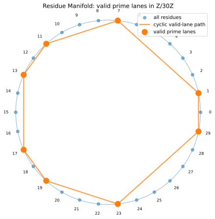
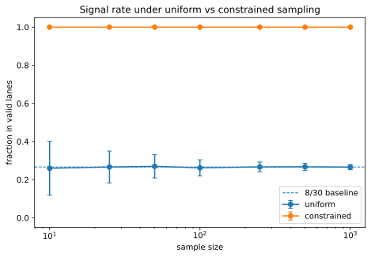
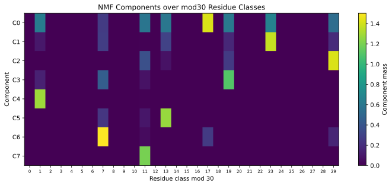
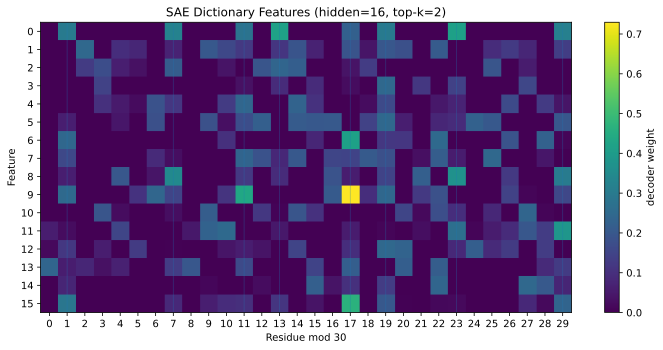
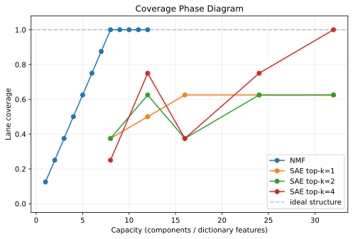
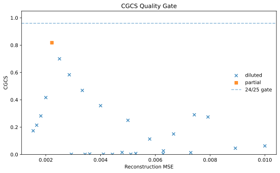
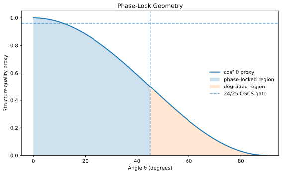

# Residue Manifold Learning  
## Constraint Sampling, Structural Recovery, and Phase-Lock Geometry

**Dan Hawkley**  
https://github.com/thinkthoughts/residue-manifold-learning  

---

## Abstract

We study structure, sampling, and representation in modular arithmetic through the mod30 residue manifold. Prime-support residues form an eight-lane discrete manifold embedded in ℤ/30ℤ. We show that constraint-aligned sampling improves signal access, that nonnegative matrix factorization (NMF) recovers the manifold compactly, and that sparse autoencoder (SAE) configurations can fragment or dilute structure despite comparable reconstruction performance. We introduce the Constraint-Guided Coherence Score (CGCS), a bounded metric for structural fidelity, and demonstrate that representation regimes separate into phase-locked, partial, and diluted regions. Finally, we give a geometric interpretation of CGCS as a cosine alignment constraint with a phase-lock boundary near 45°, unifying sampling, representation, and geometry.

---

## 1. Introduction

Structure, sampling, and representation interact in determining whether underlying patterns can be recovered from data. Apparent computational advantages often arise from access to structured representations rather than fundamentally different computational power.

We investigate this interaction in a controlled modular setting. Prime residues modulo 30 form a discrete, structured manifold, providing a minimal environment to study:

- **Structure**: existence of constrained residue lanes  
- **Sampling**: access aligned vs unaligned with structure  
- **Representation**: recovery vs fragmentation of structure  

Our goal is to isolate how these components combine to determine structural fidelity.

---

## 2. Residue Manifold Structure

Let \( n \in \mathbb{Z} \) and consider residues modulo 30:

\[
r = n \bmod 30
\]

Prime numbers lie only in:

\[
\{1, 7, 11, 13, 17, 19, 23, 29\}
\]

These residues define an eight-lane discrete manifold embedded in \( \mathbb{Z}/30\mathbb{Z} \).

**Figure 1.** Valid prime-support residues form eight discrete angular lanes, revealing structure within ℤ/30ℤ.

This structure exists independently of representation.

---

## 3. Constraint Sampling

We compare:

- Uniform sampling over all residues  
- Sampling restricted to valid lanes  

Uniform sampling yields:

\[
\text{signal rate} \approx \frac{8}{30}
\]

Constrained sampling achieves:

\[
\text{signal rate} = 1
\]

**Figure 2.** Uniform sampling spreads probability mass outside the manifold, while constraint-aligned sampling concentrates fully on valid lanes.

Sampling determines access to structure.

---

## 4. Representation and Recovery

### 4.1 NMF Recovery

Nonnegative matrix factorization (NMF) recovers the residue manifold compactly:

\[
X \approx WH
\]

where components align with residue lanes.

**Figure 3.** NMF components align directly with residue lanes, demonstrating compact recovery.

---

### 4.2 SAE Dilution

Sparse autoencoders (SAE) may introduce:

- redundant features  
- inactive features  
- diffuse feature support  

**Figure 4.** SAE features distribute across residues, producing redundancy and reduced alignment.

Representation determines whether structure is preserved or degraded.

---

## 5. Phase Diagram of Structural Regimes

We combine results into a phase diagram over model capacity.

**Figure 5.** NMF achieves full coverage at low capacity, while SAE exhibits partial, fragmented, and diluted regimes.

Observed regimes:

- Recovered  
- Partial  
- Diluted  
- Fragmented  

---

## 6. Constraint-Guided Coherence Score (CGCS)

We define:

\[
\text{CGCS} =
(\text{coverage})
(\text{alignment})
(\text{redundancy penalty})
(\text{dead feature penalty})
(\text{reconstruction penalty})
\]

CGCS is bounded in \([0,1]\).

We define a phase-lock threshold:

\[
\text{CGCS} \ge \frac{24}{25}
\]

**Figure 6.** CGCS separates phase-locked representations from degraded ones, showing that reconstruction accuracy alone is insufficient.

---

## 7. Phase-Lock Geometry

We interpret CGCS geometrically using cosine similarity:

\[
\cos \theta = \frac{A \cdot B}{\|A\| \|B\|}
\]

Structure quality corresponds to alignment angle \( \theta \):

- \( \theta \approx 0^\circ \) — fully aligned  
- \( \theta \le 45^\circ \) — phase-locked  
- \( \theta > 45^\circ \) — degraded  

**Figure 7.** Structural fidelity corresponds to alignment within a cosine-constrained phase space. The 45° boundary defines the phase-lock region.

---

## 8. Discussion

We show:

- Structure exists independently of representation  
- Sampling determines access to structure  
- Representation determines preservation of structure  

Compact representations preserve structure, while overparameterized sparse representations may degrade it.

---

## 9. Conclusion

Residue-manifold learning provides a minimal setting to study structural fidelity. CGCS unifies coverage, alignment, and representation quality into a single metric. Its geometric interpretation reveals a phase-lock boundary governing structure preservation.

---

## References

[1] E. Tang, *A quantum-inspired classical algorithm for recommendation systems*, arXiv:1807.04271 (2018).
