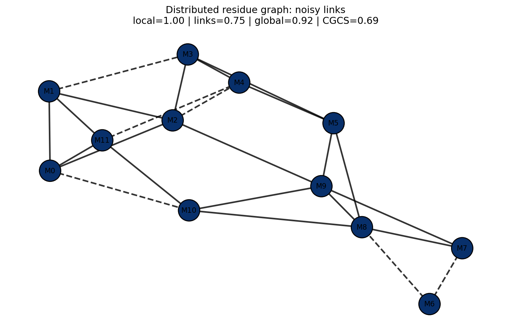
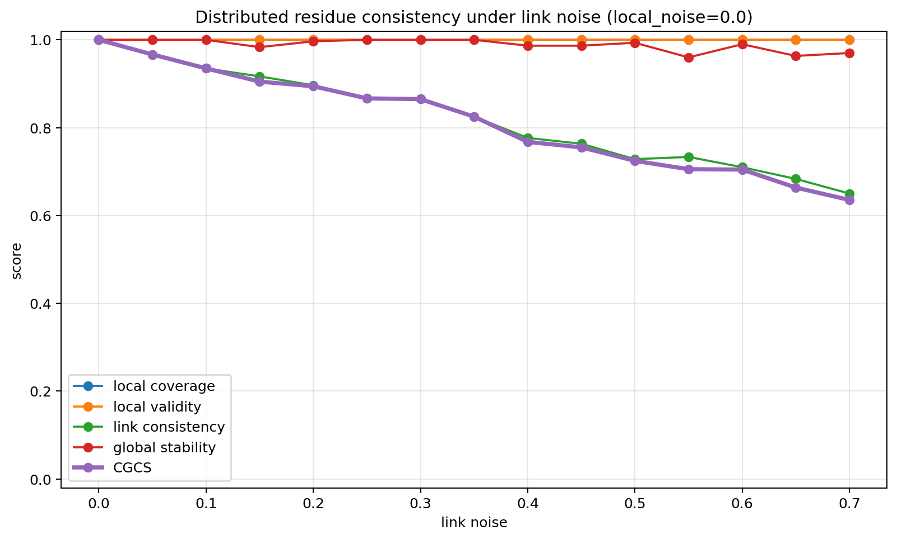
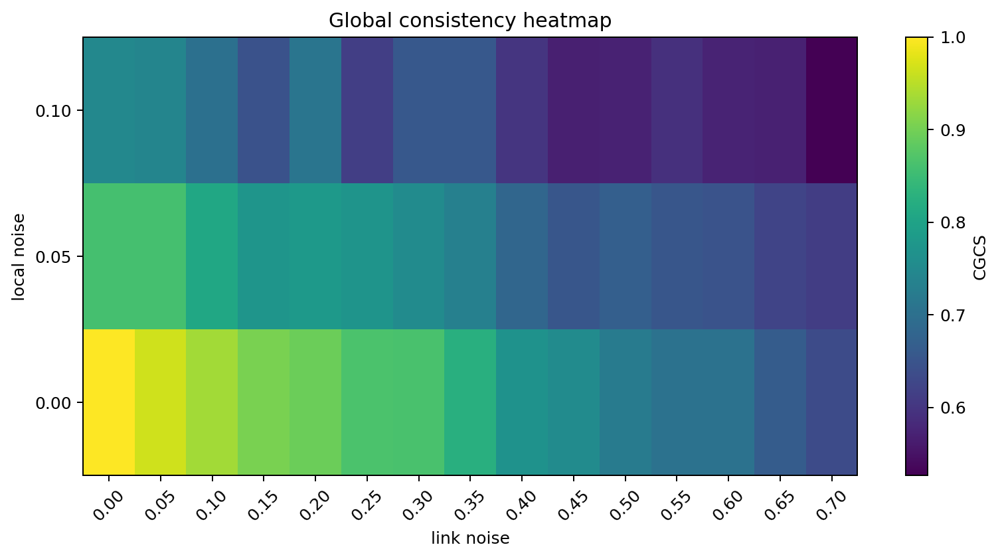
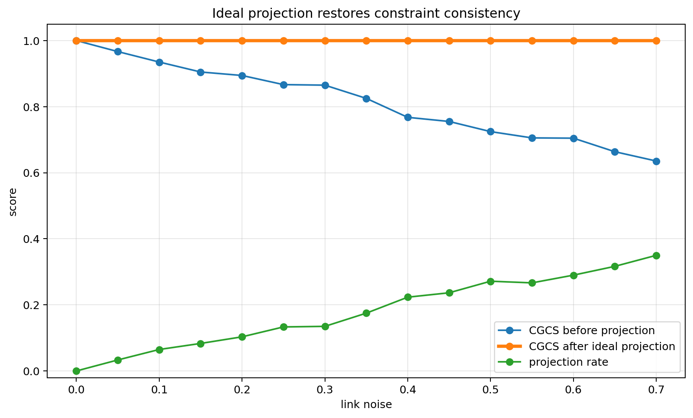
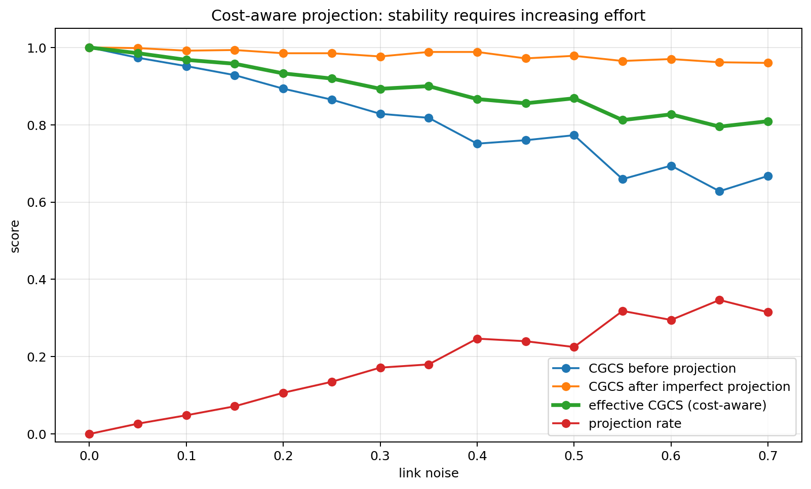
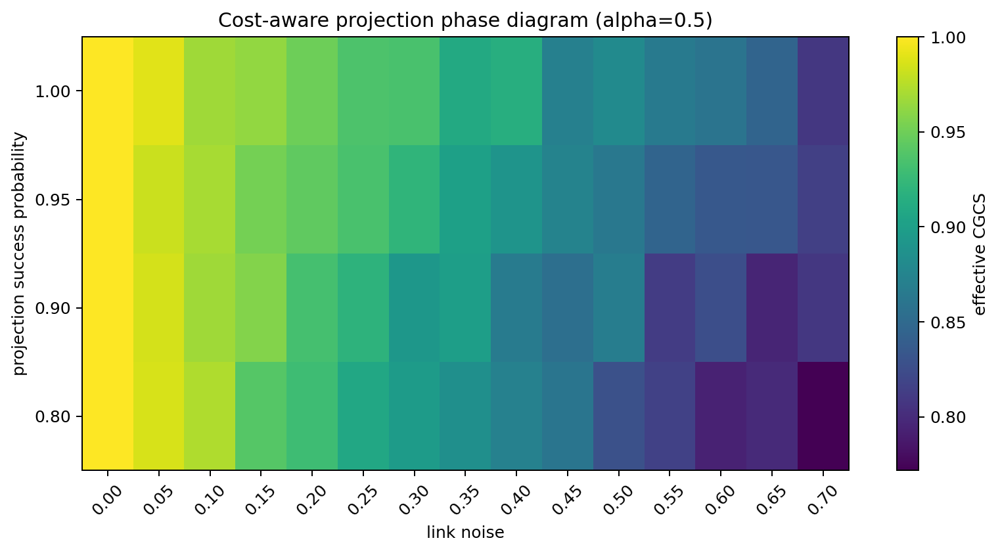

# Residue Manifold Learning:
## Constraint Sampling, Distributed Consistency, and Cost-Aware Projection

Dan Hawkley  
https://github.com/thinkthoughts/residue-manifold-learning

---

# Abstract

We study structure, representation, distributed consistency, and recovery on modular residue manifolds derived from mod30 prime-support residues.

Prime-support residues form an eight-lane discrete manifold embedded in Z/30Z. Earlier experiments demonstrated that constraint-aligned sampling improves structural access, that nonnegative matrix factorization (NMF) recovers compact manifold structure, and that sparse autoencoder (SAE) configurations can fragment or dilute structural fidelity despite similar reconstruction performance.

We extend this framework into distributed consistency experiments on residue graphs. Local residue modules remain individually valid while noisy links degrade global structural coherence. We define distributed consistency metrics using the Constraint-Guided Coherence Score (CGCS) and introduce projection-based recovery mechanisms that restore valid constraint relations across noisy links.

Finally, we introduce cost-aware projection dynamics, where stability restoration requires increasing correction effort as link noise increases.

---

# 1 Introduction

Structure, sampling, representation, and consistency interact in determining whether latent organization can persist under noise and distributed scaling.

The mod30 residue manifold provides a minimal discrete environment to study:

- constrained manifold structure,
- aligned vs unaligned sampling,
- compact vs diluted representations,
- distributed graph consistency,
- projection-based recovery,
- cost-aware stabilization.

---

# 2 Residue Manifold Structure

Prime-support residues greater than 5 lie only in:

```text
{1, 7, 11, 13, 17, 19, 23, 29}
```

These residues define an eight-lane discrete manifold embedded in Z/30Z.


---

# 3 Constraint-Guided Coherence Score (CGCS)

Distributed consistency depends on:

- local validity,
- link consistency,
- global graph stability.

We define:

```text
CGCS =
(local coverage)
(local validity)
(link consistency)
(global stability)
```

---

# 4 Distributed Residue Consistency

Distributed residue graphs maintain local structure while exposing sensitivity to noisy links.



Dashed edges indicate inconsistent relations introduced through link corruption.

---

# 5 Noise Sweeps and Global Stability

As link noise increases:

- local validity remains high,
- global consistency degrades,
- CGCS decreases,
- distributed coherence fragments.





---

# 6 Projection-Based Recovery

Projection acts as a decoder analogue:

```text
noisy relation
→ nearest valid residue relation
→ restored consistency
```



---

# 7 Cost-Aware Projection

We define:

```text
effective_CGCS
=
CGCS_after
(1 - alpha * projection_rate)
```

where:
- projection rate measures correction workload,
- alpha measures correction cost sensitivity.





---

# 8 Discussion

The residue manifold now functions as a distributed constraint framework rather than only a representation-learning experiment.

The framework demonstrates:

- structure persists under constraints,
- distributed consistency depends on links,
- projection can restore validity,
- stabilization requires increasing correction effort.

---

# 9 Conclusion

Residue-manifold learning provides a minimal environment for studying distributed structural consistency under noisy links.

Projection-based recovery and cost-aware stabilization extend CGCS into a distributed systems observable describing the relationship between noise, correction effort, and global coherence.

---

# References

1. E. Tang, A quantum-inspired classical algorithm for recommendation systems, arXiv:1807.04271 (2018).
